<div align="center">

# 📊 Python Engineering, Data Analysis & Mini-Projects

[](https://github.com/ankush850)
[](https://github.com/ankush850/Python-Project)
[](https://www.python.org/)
[](https://github.com/ankush850/Python-Project)
[](LICENSE)

<p align="center">
  A premier open-source repository featuring <b>80+ Practical Python Mini-Projects</b> spanning <b>Data Analysis & Statistics</b>, <b>Machine Learning & Deep Learning</b>, <b>Computer Vision & Audio Synthesis</b>, <b>Full Desktop GUI Applications</b>, <b>Enterprise Management Systems</b>, <b>Web Scraping & APIs</b>, and <b>Interactive 2D/Arcade Games</b>.
</p>

[📊 Data Analysis & ML](#-1-data-analysis-statistics--machine-learning) • [💼 Management Systems](#-2-management--financial-information-systems) • [👁️ Vision & Audio](#-3-computer-vision-multimedia--voice-automation) • [🖥️ Desktop GUIs](#-4-desktop-gui-applications--utilities) • [🌐 Web & APIs](#-5-web-scraping-apis--network-tools) • [🎮 Games & Simulations](#-6-interactive-games--simulations) • [⚡ Core Scripts](#-7-standalone-core-scripts) • [🚀 Quick Start](#-quick-start)

</div>

---

## 🏛️ Repository Architecture

```mermaid
graph TD
    Root["📂 Python-Project (ankush850)"] --> DA["📊 Data Analysis & Machine Learning"]
    Root --> MIS["💼 Management & Financial Systems"]
    Root --> CV["👁️ Computer Vision & Audio Systems"]
    Root --> GUI["🖥️ Desktop GUI Apps & Utilities"]
    Root --> Web["🌐 Web Scraping & APIs"]
    Root --> Game["🎮 Games & Interactive Simulations"]
    Root --> Core["⚡ Standalone Utility Scripts"]

    DA --> DA1["Cookie Cats Mobile Game A/B Test"]
    DA --> DA2["E-Commerce Conversion A/B Test"]
    DA --> DA3["WeRateDogs Twitter Wrangling & Analysis"]
    DA --> DA4["TMDb Movies 10k+ Dataset EDA"]
    DA --> DA5["Spotify 17 Artists Audio Feature EDA"]
    DA --> DA6["COVID-19 Vaccination Time Series"]
    DA --> DA7["Waste Segregation Deep Learning Model"]
    DA --> DA8["Habit Tracker with Data Viz"]
    DA --> DA9["Journal with Sentiment Analysis"]

    MIS --> MIS1["ATM Banking Simulator"]
    MIS --> MIS2["Hotel Management System"]
    MIS --> MIS3["Blood Bank Management System"]
    MIS --> MIS4["Student Management System"]
    MIS --> MIS5["Grocery Store Management System"]
    MIS --> MIS6["Personal Expense Tracker"]
    MIS --> MIS7["Loan EMI Calculator"]

    CV --> CV1["Voice-Controlled Home Automation"]
    CV --> CV2["Digital Whiteboard Canvas"]
    CV --> CV3["OpenCV Road & Lane Detection"]
    CV --> CV4["Image to ASCII & Pencil Sketch"]
    CV --> CV5["Dynamic QR Code Generator"]
    CV --> CV6["PDF to AudioBook Speech Synthesizer"]
    CV --> CV7["Audio & Image CAPTCHA Generator"]

    GUI --> GUI1["Calculator (Tkinter & PySide6)"]
    GUI --> GUI2["Monthly Calendar (PySide6)"]
    GUI --> GUI3["Simple Text Editor (PySide6)"]
    GUI --> GUI4["PostgreSQL Persistent To-Do"]
    GUI --> GUI5["Multi-Language Translator"]
    GUI --> GUI6["Password Strength & Generator"]
    GUI --> GUI7["Task Scheduler & System Utilities"]

    Web --> Web1["COVID-19 Worldometer Web Scraper"]
    Web --> Web2["CoWin Vaccine Slot Tracker"]
    Web --> Web3["Full Page Selenium Screenshot"]
    Web --> Web4["Multi-Thread Availability Checker"]
    Web --> Web5["Interactive Candlestick Visualizer"]
    Web --> Web6["Live Weather Forecast Dashboard"]

    Game --> Game1["Chess Game with Board Engine"]
    Game --> Game2["Ludo Game Simulation"]
    Game --> Game3["Tic-Tac-Toe with AI / 2-Player"]
    Game --> Game4["Retro Snake & Pong Arcade"]
    Game --> Game5["Slot Machine Casino Game"]
    Game --> Game6["Virtual Plant Care Simulator"]
```



---

## 📂 Project Catalog

Each directory is self-contained with its dedicated source code, documentation, and dependencies.

---

### 📊 1. Data Analysis, Statistics & Machine Learning

| Project | Description | Primary Stack | Run Command |
| :--- | :--- | :--- | :--- |
| [**Cookie Cats A/B Testing**](AB-testing/ab_testing_Mobile_Games/README.md) | Mobile game player retention analysis (Gate 30 vs 40) using bootstrapping & Chi-Square tests. | `pandas`, `scipy`, `statsmodels`, `seaborn` | `jupyter notebook AB_Testing_Cookies_Dataset.ipynb` |
| [**E-Commerce A/B Testing**](AB-testing/analyze-ab-test-results/README.md) | Landing page conversion rate analysis with hypothesis testing, Z-scores & logistic regression. | `pandas`, `scipy`, `statsmodels`, `matplotlib` | `jupyter notebook Analyze_ab_test_results_notebook.ipynb` |
| [**WeRateDogs Twitter Wrangling**](Data%20Wrangling%20and%20EDA/HarshDeepKalita-Data-Analyze-and-Wrangle-Project/README.md) | Multi-source data wrangling (REST API, TSV, JSON), quality cleaning, and dog rating metrics. | `pandas`, `requests`, `seaborn`, `ipython` | `jupyter notebook wrangle_act.ipynb` |
| [**TMDb Movies 10k+ EDA**](Data%20Wrangling%20and%20EDA/Harsh_Deep_Kalita_TMDb_DataSet/README.md) | Analysis of 10,000+ films: revenue correlations, runtime sweet-spots, genres & profitability. | `pandas`, `numpy`, `seaborn`, `matplotlib` | `jupyter notebook Harsh-Deep-Kalita-TMDb-Data-Set.ipynb` |
| [**Spotify Audio Features EDA**](Data%20Wrangling%20and%20EDA/Spotify-EDA/README.md) | Music feature analysis (danceability, energy, valence) across 17 artists using Spotipy & Waffle charts. | `spotipy`, `pywaffle`, `pandas`, `seaborn` | `jupyter notebook "My_Favorite_Artists _Spotify_Data_Exploration.ipynb"` |
| [**COVID-19 Time Series Analysis**](MiniProject-College-Lab-TimeSeriesAnalysis/README.md) | State-wise vaccination rollout analysis, seasonal trend decomposition, and predictive modeling. | `statsmodels`, `scikit-learn`, `joblib`, `pandas` | `jupyter notebook miniprojectdsbdal31232.ipynb` |
| [**Waste Segregation ML Model**](waste_management_ML_model/README.md) | Deep learning neural network classification model for automated waste category segregation. | `tensorflow`, `scikit-learn`, `pandas`, `seaborn` | `jupyter notebook Untitled10.ipynb` |
| [**Habit Tracker with Data Viz**](Habit%20Tracker%20with%20Data%20Visualization/README.md) | Daily habit consistency tracker with visual matplotlib analytics and completion heatmaps. | `matplotlib`, `pandas`, `tkinter` | `python habit_tracker.py` |
| [**Journal Sentiment Analysis**](Personal%20Journal%20with%20Sentiment%20Analysis/README.md) | Daily journaling diary with TextBlob NLP sentiment analysis and mood trends over time. | `textblob`, `tkinter`, `sqlite3` | `python personal_journal.py` |
| [**Plagiarism Checker**](Plagiarism_Checker/README.md) | Document similarity detector using TF-IDF Vectorization and Cosine Similarity metrics. | `scikit-learn`, `os` | `jupyter notebook 019_Plagiarism_Checker.ipynb` |

---

### 💼 2. Management & Financial Information Systems

| Project | Description | Framework / Stack | Run Command |
| :--- | :--- | :--- | :--- |
| [**ATM Simulator**](ATM%20Simulator/README.md) | Full banking simulator with PIN authentication, balance queries, deposits, and cash withdrawals. | Pure Python (OOP) | `python atm_simulator.py` |
| [**Hotel Management System**](Hotel%20Management%20System/README.md) | Room booking, guest registration, check-in/check-out billing, and vacancy management system. | `tkinter`, `sqlite3` | `python hotel_management.py` |
| [**Blood Bank Management**](Blood%20Bank%20Management%20System/README.md) | Donor database, blood inventory tracking by blood group, and emergency dispatch management. | `sqlite3`, Pure Python | `python BloodBank.py` |
| [**Student Management System**](Student%20Management%20System/README.md) | Student record registry with enrollment tracking, grade management, and student search. | `tkinter`, `sqlite3` | `python student_management.py` |
| [**Grocery Store Management**](Grocery%20Store%20Management%20System/README.md) | Product stock inventory, barcode search, cart invoicing, and sales revenue calculation. | Pure Python / `sqlite3` | `python grocery_store.py` |
| [**Personal Expense Tracker**](Personal%20Expense%20Tracker/README.md) | Budget tracker categorizing expenditures, monthly allowance balance, and summary charts. | `tkinter`, `matplotlib`, `csv` | `python personal_expense_tracker.py` |
| [**Loan EMI Calculator**](Loan%20EMI%20Calculator/README.md) | Calculates Equated Monthly Installment (EMI), total interest payable, and amortization schedules. | `tkinter`, `math` | `python loan_emi_calculator.py` |
| [**Currency Converter**](currency_converter_nbp_api/README.md) | Live currency exchange converter calculating rates into PLN, USD, EUR, and GBP via NBP API. | `Tkinter`, `requests` | `python currency_converter_nbp_api.py` |
| [**Stock Market Intelligence**](stock_info_yfinance/README.md) | Desktop dashboard querying live company fundamentals, market capitalization, and valuation. | `Tkinter`, `yfinance` | `python stock_info_yfinance.py` |

---

### 👁️ 3. Computer Vision, Multimedia & Voice Automation

| Project | Description | Primary Stack | Run Command |
| :--- | :--- | :--- | :--- |
| [**Voice Home Automation**](Voice-Controlled%20Home%20Automation%20Simulator/README.md) | Voice-command simulated smart home appliances (lights, AC, locks) using speech recognition. | `speech_recognition`, `pyttsx3` | `python home_automation.py` |
| [**Digital Whiteboard**](Digital%20White%20Board/README.md) | Interactive free-hand drawing canvas with color palette, brush thickness, and image save. | `tkinter` Canvas | `python whiteboard.py` |
| [**Road & Lane Detection**](Road_Detection/README.md) | Real-time highway lane edge detection using OpenCV (Canny, Sobel, Laplacian, ROI Masking). | `opencv-python`, `matplotlib` | `jupyter notebook 020_Road_Detection.ipynb` |
| [**Image to ASCII & Sketch**](Convert_image_to_ASCII/README.md) | Converts color images into ASCII character art and high-contrast pencil sketch renderings. | `opencv-python`, `pywhatkit` | `jupyter notebook 009_Convert_image_to_ASCII_and_PencilSketch.ipynb` |
| [**Generate QR Code**](Generate_QR_Code/README.md) | Dynamic generation of customizable PNG and SVG QR codes for URLs and text. | `pyqrcode`, `pypng` | `jupyter notebook 011_Generate_QR_Code.ipynb` |
| [**PDF AudioBook Generator**](Create_AudioBook_from_PDF/README.md) | Extracts text from PDF books and synthesizes speech using Python Text-to-Speech (`pyttsx3`). | `PyPDF2`, `pyttsx3` | `jupyter notebook 007_Create_AudioBook_from_PDF.ipynb` |
| [**Encode CAPTCHA**](Encode_CAPTCHA/README.md) | Generates randomized audio and graphical CAPTCHA challenges for security validation. | `captcha` | `jupyter notebook 012_Encode_CAPTCHA.ipynb` |
| [**Alarm Clock**](Alarm%20Clock/README.md) | Desktop alarm clock triggering custom audio tone notifications at scheduled times. | `datetime`, `playsound`, `tkinter` | `python "Alarm Clock.py"` |
| [**Digital Clock & Stopwatch**](Create_Digital_Clock/README.md) | Desktop digital clock and millisecond-accurate stopwatch interface. | `tkinter`, `datetime` | `jupyter notebook 002_Create_Digital_Clock_and_Stopwatch.ipynb` |
| [**Stopwatch Application**](Stopwatch%20Application/README.md) | Dedicated stopwatch GUI with lap timing, pause, reset, and millisecond counters. | `tkinter` | `python stopwatch.py` |
| [**Countdown Timer**](Countdown%20timer/README.md) | Configurable hours/minutes countdown timer with sound alerts upon completion. | `tkinter`, `time` | `python countdown_timer.py` |

---

### 🖥️ 4. Desktop GUI Applications & Utilities

| Project | Description | Framework / Stack | Run Command |
| :--- | :--- | :--- | :--- |
| [**Calculator**](calculator/README.md) | Dual desktop calculator implementations with responsive layouts. | `Tkinter` / `PySide6` | `python calculator.py`<br>`python "calculator (2).py"` |
| [**BMI Calculator**](BMI_calulator/README.md) | Body Mass Index calculator with health category classification (underweight, normal, obese). | `tkinter` | `python BMI_calulator.py` |
| [**Monthly Calendar**](calendar/README.md) | Interactive monthly calendar GUI with year/month navigation. | `PySide6` (Qt) | `python calendar.py` |
| [**Simple Text Editor**](simple_text_editor/README.md) | Desktop document editor with native file open, edit, and save toolbars. | `PySide6` (Qt) | `python simple_text_editor.py` |
| [**Persistent To-Do App**](to_do_app/README.md) | Task management GUI with full CRUD persistence in PostgreSQL. | `Tkinter`, `psycopg2` | `python to_do_app.py` |
| [**TO-DO List Application**](TO-DO%20List%20Application/README.md) | Lightweight desktop to-do list manager with task completion checkboxes. | `tkinter` | `python todo_app.py` |
| [**Simple Contact Book**](Simple%20Contact%20Book/README.md) | Phonebook address directory with contact addition, editing, deletion, and quick search. | `tkinter`, `json` | `python contact_book.py` |
| [**Multi-Language Translator**](Translate/README.md) | Translates phrases and text across 50+ languages using Google Translate API. | `googletrans`, `tkinter` | `python translate.py` |
| [**Password Strength Checker**](Password%20Strength%20Checker/README.md) | Evaluates password complexity (entropy, length, uppercase, numbers, symbols). | `re`, `tkinter` | `python password_checker.py` |
| [**Random Password Generator**](Random%20Password%20Generator/README.md) | Generates cryptographically secure alphanumeric & symbol passwords. | `secrets`, `string` | `python password_generator.py` |
| [**Python Task Scheduler**](Python%20Task%20Scheduler/README.md) | Automated job runner scheduling recurring Python scripts at defined intervals. | `schedule`, `time` | `python task_scheduler.py` |
| [**Word Count Tool**](Word%20Count%20Tool/README.md) | Analyzes text files for total words, characters, sentences, and average reading time. | Pure Python | `python word_counter.py` |
| [**Number to Words Converter**](Number%20to%20Words/README.md) | Converts numerical digits into written English currency and word format. | `num2words` | `python num_to_words.py` |
| [**Binary-Decimal Converter**](Binary-Decimal%20Converter/README.md) | Bidirectional number base converter supporting binary, decimal, octal, and hex. | Pure Python | `python converter.py` |
| [**Palindrome Checker**](Palindrome%20Checker/README.md) | Checks whether words, sentences, or numbers read the same backwards. | Pure Python | `python palindrome.py` |
| [**Convert .py to .exe**](Convert_.py_to_.exe/README.md) | Compiles Python source code into standalone Windows executable binaries. | `pyinstaller` | `jupyter notebook 003_Convert_.py_to_.exe.ipynb` |
| [**Convert Notebook to PDF**](Convert_IPython_to_PDF/README.md) | Automates exporting Jupyter Notebooks into formatted PDF reports using `nbconvert`. | `nbconvert` | `jupyter notebook 001_Convert_IPython_to_PDF.ipynb` |
| [**Unzip File Utility**](Unzip_File/README.md) | Programmatically unpacks and extracts compressed ZIP archives to target destinations. | `zipfile` | `jupyter notebook 013_Unzip_File.ipynb` |

---

### 🌐 5. Web Scraping, APIs & Network Tools

| Project | Description | Tech Stack | Run Command |
| :--- | :--- | :--- | :--- |
| [**COVID-19 Data Scraper**](Web_Scraping_Covid-19_Data/README.md) | Scrapes real-time global coronavirus statistics from Worldometer and exports CSV data. | `beautifulsoup4`, `pandas`, `requests` | `jupyter notebook 015_Web_Scraping_Covid-19_Data.ipynb` |
| [**CoWin Vaccine Slot Tracker**](Web_Scraping_CoWin_Vaccine_Slots/README.md) | Real-time automated tracker checking vaccination appointment availability in India. | `requests`, `pygame` | `jupyter notebook 016_Web_Scraping_CoWin_Vaccine_Slots.ipynb` |
| [**Weather App GUI**](Weather_app/README.md) | Modern desktop weather forecast app fetching live temperature, humidity, and condition. | `requests`, `tkinter` | `python weather_app.py` |
| [**Weather Forecast CLI**](Check_Weather_Forecast/README.md) | Terminal ANSI weather reports for any city worldwide via `wttr.in`. | `requests` | `jupyter notebook 006_Check_Weather_Forecast.ipynb` |
| [**Weather Forecast Tkinter**](Check_Weather_Forecast_with_GUI/README.md) | Desktop weather app with dynamic weather condition icons and 5-day forecasts. | `tkinter`, `Pillow`, `requests` | `jupyter notebook 017_Check_Weather_Forecast_with_GUI.ipynb` |
| [**Currencies NBP CLI**](currencies_nbp_api/README.md) | Command-line foreign exchange rate lookup using NBP REST API. | `requests` | `python currencies_nbp_api.py` |
| [**Full Page Screenshot Downloader**](full_page_screenshot_downloader/README.md) | Automated headless Chrome browser screenshot capturing with auto-resizing. | `selenium`, `webdriver-manager` | `python full_page_screenshot_downloader.py` |
| [**Multi-Thread Availability Checker**](multi_thread_website_availability_checker/README.md) | High-speed concurrent URL uptime validator generating `report.txt`. | `requests`, `validators`, `threading` | `python main.py` |
| [**Live Website Uptime Monitor**](website_checker/README.md) | Multi-threaded background status checker with response latency feed. | `Tkinter`, `requests`, `threading` | `python website_checker.py` |
| [**Website HTML Downloader**](website_downloader/README.md) | CLI utility to validate target URLs and download complete raw webpage files. | `requests`, `validators` | `python website_downloader.py <URL>` |
| [**Get IP & Hostname**](Get%20IP%20address%20and%20Hostname%20of%20Website/README.md) | Resolves domain name DNS to IPv4/IPv6 addresses and server hostnames. | `socket` | `python get_ip.py` |
| [**Find IP Address**](Find_IP_Address/README.md) | Retrieves device local IP address and external routing info. | `socket` | `jupyter notebook 004_Find_IP_Address.ipynb` |
| [**Google Search Automation**](Perform_Google_Search/README.md) | Instant programmatic Google searching and browser query dispatch. | `pywhatkit` | `jupyter notebook 010_Perform_Google_Search.ipynb` |
| [**URL Shortener**](URL%20Shortener/README.md) | Shortens long URLs via TinyURL API with copy-to-clipboard functionality. | `pyshorteners`, `tkinter` | `python url_shortener.py` |

---

### 🎮 6. Interactive Games & Simulations

| Project | Description | Stack / Engine | Run Command |
| :--- | :--- | :--- | :--- |
| [**Chess Game**](Chess%20Game/README.md) | Two-player Chess with valid move highlighting, piece logic, check/checkmate detection. | `pygame` / `tkinter` | `python "Chess Game.py"` |
| [**Ludo Game**](Ludo%20Game/README.md) | Classic multi-player board game with dice rolling mechanics and pawn routing. | `pygame` / Pure Python | `python ludo_game.py` |
| [**Tic-Tac-Toe Game**](Tic-Tac-Toe%20Game/README.md) | Tic-Tac-Toe with interactive grid and unbeatable Minimax AI mode. | `tkinter` | `python tic_tac_toe.py` |
| [**Rock, Paper, Scissors**](Rock,%20Paper,%20Scissors%20Game/README.md) | Arcade game against the computer with score tracking and round statistics. | Pure Python / `tkinter` | `python rps_game.py` |
| [**Number Guessing Game**](Number%20Guessing%20Game/README.md) | Interactive guessing game with hint feedback (higher/lower) and attempt counter. | Pure Python | `python number_guessing.py` |
| [**Recipe Recommendation System**](Recipe%20Recommendation%20System/README.md) | Suggests cooking recipes based on available user ingredients in stock. | Pure Python / `json` | `python recipe_system.py` |
| [**Virtual Plant Care Simulator**](Virtual%20Plant%20Care%20Simulato/README.md) | Tamagotchi-style virtual plant simulation managing water, sunlight, and growth stages. | Pure Python / `tkinter` | `python plant_care.py` |
| [**Python Quiz Application**](Python%20Quiz%20Application/README.md) | Multiple-choice quiz application with timer countdown and score tallying. | `tkinter` | `python quiz_app.py` |
| [**OpenTDB Trivia Quiz**](quiz/README.md) | Terminal trivia game fetching dynamic questions by category & difficulty from OpenTDB. | `requests`, `html` | `python quiz.py` |
| [**Classic Retro Snake**](snake_game/README.md) | Classic arcade game with food generation, collision detection, and score saving. | `turtle` | `python main.py` |
| [**Snake Game GUI**](Snake%20Game/README.md) | Pygame / Tkinter enhanced Snake game implementation with obstacle mechanics. | `pygame` | `python snake_game.py` |
| [**Two-Player Pong**](pong_game.py) | Classic 2-player Pong arcade game with ball physics and score keeping. | `turtle` | `python pong_game.py` |
| [**Casino Slot Machine**](slot_machine.py) | Casino slot machine text betting game with lines, betting balance, and payout logic. | Pure Python | `python slot_machine.py` |
| [**Draw Sakura Tree**](Draw_Sakura_Tree/README.md) | Recursive tree fractal generator simulating a blooming Japanese cherry blossom tree. | `turtle`, `random` | `jupyter notebook 018_Draw_Sakura_Tree.ipynb` |

---

### ⚡ 7. Standalone Core Scripts

| Script | Description | Primary Module | Run Command |
| :--- | :--- | :--- | :--- |
| **`speaking_news_bot.py`** | Audio voice bot that fetches top news headlines and reads them aloud. | `pyttsx3`, `requests` | `python speaking_news_bot.py` |
| **`bitcoin_price.py`** / **`bitcoin_price_with_api_key.py`** | Real-time Bitcoin (BTC) cryptocurrency price tracker. | `requests` | `python bitcoin_price.py` |
| **`bitcoin_address.py`** | Bitcoin wallet address generation demonstration. | `bitcoin` | `python bitcoin_address.py` |
| **`WiFi_Scanning.py`** | Scans and lists nearby available Wi-Fi networks and signal strengths. | `subprocess` | `python WiFi_Scanning.py` |
| **`take_a_screenshot.py`** | Quick desktop screen capture utility saving timestamped images. | `pyautogui` | `python take_a_screenshot.py` |
| **`text_to_speech.py`** | Converts text strings into offline spoken audio. | `pyttsx3` | `python text_to_speech.py` |
| **`shorten_the_link.py`** | URL shortener using the TinyURL API. | `pyshorteners` | `python shorten_the_link.py` |
| **`morse_code_script.py`** | Text-to-Morse and Morse-to-Text bidirectional encoder/decoder. | Pure Python | `python morse_code_script.py` |
| **`cryptography.py`** | Symmetric data encryption and decryption using AES/Fernet tokens. | `cryptography` | `python cryptography.py` |
| **`color_text.py`** | Formatted ANSI colorized and styled console output. | `colorama` | `python color_text.py` |
| **`validator_credit_cards.py`** | Luhn algorithm verification for Visa, MasterCard, and Amex credit cards. | Pure Python | `python validator_credit_cards.py` |
| **`convolutional_neural_network_CNN_algorithm_exampe.py`** | CNN model training pipeline for image classification. | `tensorflow` / `keras` | `python convolutional_neural_network_CNN_algorithm_exampe.py` |
| **`excel_in_python.py`** | Reads and manipulates Excel spreadsheet workbooks programmatically. | `openpyxl` / `pandas` | `python excel_in_python.py` |
| **`web_automation.py`** / **`web_scraping.py`** | Browser automation and HTML scraping helper routines. | `selenium`, `beautifulsoup4` | `python web_scraping.py` |
| **`class_example.py`** | Demonstrates object-oriented programming, class design, and inheritance in Python. | Pure Python | `python class_example.py` |
| **`softuni_chedule.py`** | Parses course timetable data and class schedules from the SoftUni education portal. | `requests`, `bs4` | `python softuni_chedule.py` |

---

## 🚀 Quick Start

### 1. Clone the Repository
```bash
git clone https://github.com/ankush850/Python-Project.git
cd Python-Project
```

### 2. Run Any Individual Project
Each subproject folder contains its own code and requirements. Navigate to the desired folder:

```bash
# Example: Hotel Management System
cd "Hotel Management System"

# (Optional) Create & activate a virtual environment
python -m venv venv
.\venv\Scripts\Activate.ps1   # On Windows
source venv/bin/activate      # On Linux/macOS

# Install dependencies if present
pip install -r requirements.txt

# Launch application
python hotel_management.py
```

---

## ⚙️ Prerequisites

- **Python**: `3.9+` recommended.
- **PostgreSQL**: Required for `to_do_app` and `random_quote`.
- **Google Chrome**: Required for Selenium automation in `full_page_screenshot_downloader`.
- **Jupyter Notebook**: For exploring all `.ipynb` data analysis files.

---

## 👤 Author
- **GitHub**: [@ankush850](https://github.com/ankush850)
- **Repository**: [ankush850/Python-Project](https://github.com/ankush850/Python-Project)

---

## 📄 License
This project is licensed under the [MIT License](LICENSE).
